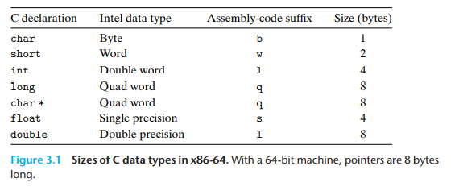
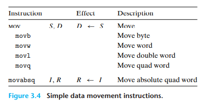
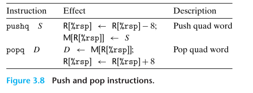

# Chapter 3 x86-64 Assembly

## 3.1 编译与反编译工具
> `gcc`编译文件
```bash
# 将C源文件编译至汇编级别
$ gcc -Og -S test.c
# -Og -O2 -O1 代表优化级别

# 编译至目标代码级别
$ gcc -c test.c
```
> 反汇编器
```bash
$ objdump -d bin
```

## 3.2 x86-64 汇编语言(AT&T格式)

### 3.2.1 数据访问与信息格式

1. 三类访问对象：立即数、寄存器、储存器

2. 数据格式：  


3. 整数寄存器：


4. 指令格式：


### 3.2.2 指令

#### **数据传送指令**
> 大写代表一类运算，根据格式自动加上指令后缀  
> 小写代表特定运算

1. 等长数据传送：



> x86-64特点：
> 1. 传送指令的两个操作数不能都指向内存位置 
> 2. 任何为寄存器生成32位值的行为都会将寄存器高位置为0

2. 数据扩充传送：  

零扩充：


符号扩充：


3. 栈操作：



4. 算术运算：


特别的算术运算：


#### **跳转指令**

1. 条件码设置与使用指令

> 符号寄存器`flag`：  
> `ZF`: zero flag 零标志位  
> `SF`: sign flag 符号标志位  
> `CF`: carry flag 进位标志位, 用于无符号数运算  
> `OF`: overflow flag 溢出标志位，用于有符号数运算

*设置条件码*：

> `leap`不改变标志位  
> 逻辑操作不改变`CF`, `OF`  
> `dec, inc`不改变进位标志位


*条件码的使用：set指令*
> `set`指令根据`flag`的状态设定单位字节`D`为1或0
> 练习题参看3-13,3-14


2. 跳转指令：

> 间接跳转：  
> `jmp *%rax`：以%rax中地址为目标跳转  
> `jmp *(%rax)`：以内存`(%rax)`中地址为目标跳转

> 相对寻址：  
> 计算相对地址时，基址为`jmp`指令下一条指令的地址


3. 使用数据的跳转：

- 流水线(pipelining):   
  x86-64处理器通过流水线提高性能，类似于将许多指令提前置于CPU内。  
  使用控制的跳转指令的指令序列是不可预测的，而使用数据的跳转指令的指令序列是可预测的。因此后者时间成本期望较低。

- 条件传送指令：  
  

4. 调用控制指令

> 与16位汇编不同，x86-64的地址转移时只需要将%rip压栈


### 3.2.3 循环

#### `do-while`循环

循环模式：
```
do
    body-statement;
while (test-expr);
```
汇编等价的`goto`描述：
```C
loop:
    body-statement;
    t=test-expr;
    if(t)
        goto loop;
```

#### `while`循环

循环模式：
```
t=test-expr;
while(t)
    body-statement;
```
汇编等价的`goto`描述：
```C
//1. jump to middle
goto test;
loop:
    body-statement;
test:
    t=test-expr;
    if(t)
        goto loop;

//2. guarded-do 
t=test-expr;
if(!t)
    goto done;
loop:
    body-statement;
    if(t)
        goto loop;
done:
```

#### `for`循环

等价于特殊的`while`循环

### 3.2.4 `switch`与跳转表

- switch的实现：  
    将多个入口映射为一个代码块指针数组。
- 逆向工程：  
  - 确定映射关系
  - 找到`default`代码块
  - 一一对应

```C
void switcher(long a, long b, long c, long *dest)
{
    long val=0;
    switch(a){
        case 5:
            c=b^15;
        case 0:
            val=c+112;
            break;
        case 2:
        case 7:
            val=(a+b)*4; 
            break;
        case 4:
            val=a;
            break;
        default:
            val=b;
    }
    *dest=val;
}
```

`gcc`编译至汇编级别：
```x86asm
	.file	"main.c"
	.text
	.globl	switcher
	.type	switcher, @function
switcher:
.LFB0:
	.cfi_startproc
	endbr64
	cmpq	$7, %rdi
	ja	.L6
	leaq	.L4(%rip), %r8
	movslq	(%r8,%rdi,4), %rax
	addq	%r8, %rax
	notrack jmp	*%rax
	.section	.rodata
	.align 4
	.align 4
.L4:
	.long	.L7-.L4
	.long	.L6-.L4
	.long	.L3-.L4
	.long	.L6-.L4
	.long	.L8-.L4
	.long	.L5-.L4
	.long	.L6-.L4
	.long	.L3-.L4
	.text
.L5:
	movq	%rsi, %rdx
	xorq	$15, %rdx
.L7:
	leaq	112(%rdx), %rsi
.L6:
	movq	%rsi, (%rcx)
	ret
.L3:
	addq	%rdi, %rsi
	salq	$2, %rsi
	jmp	.L6
.L8:
	movq	%rdi, %rsi
	jmp	.L6
	.cfi_endproc
.LFE0:
	.size	switcher, .-switcher
	.ident	"GCC: (Ubuntu 9.4.0-1ubuntu1~20.04) 9.4.0"
	.section	.note.GNU-stack,"",@progbits
	.section	.note.gnu.property,"a"
	.align 8
	.long	 1f - 0f
	.long	 4f - 1f
	.long	 5
0:
	.string	 "GNU"
1:
	.align 8
	.long	 0xc0000002
	.long	 3f - 2f
2:
	.long	 0x3
3:
	.align 8
4:
```


### 3.2.5 过程与调用

1. 过程：一个子例程，谓之过程。如C中的函数，python中的方法。  

过程的调用包括3个重要动作：
- 传递控制。即将%rip压栈
- 传递数据。即通过寄存器和堆栈传递参数
- 分配和释放内存。即给局部变量分配和释放栈上的内存


2. 调用模型:  


- 调用参数首选用寄存器传送，当参数大于6个，使用栈帧传送。
  - 传送用寄存器：`%rdi, %rsi, %rdx, %rcx, %r8, %r9`(视参数大小使用寄存器的部分)
  - 栈帧传送参数：从最后一个参数依次入栈。

- 调用时使用寄存器
  - 被调用者保存寄存器：`%rbx, %rbp, %r12~%r15`  
  	调用时子程序需要保存这部分寄存器中的值，子程序不可随意使用这些寄存器。
  - 调用者保存寄存器：除`%rsp`以及上述寄存器外的寄存器  
  	调用时父程序应先保存这部分寄存器中的值，这部分寄存器可以随意使用。

- 局部变量内存的分配：调整`%sp`的值，发生于
  - 寄存器不足以储存变量
  - 对变量进行了取地址`&`操作
  - 变量是数组和结构变量

  ### 3.2.6 异质数据结构的对齐

>  对齐原则：  
> 任何`K`字节的基本对象的基址必须是`K`的整数倍  


- 结构末尾也可能出现填充，以满足结构数组的对齐要求  
例如：
```C
struct S{
	int i;
	int j;
	int j;
};
```
`S`的数据长度不是9而是12