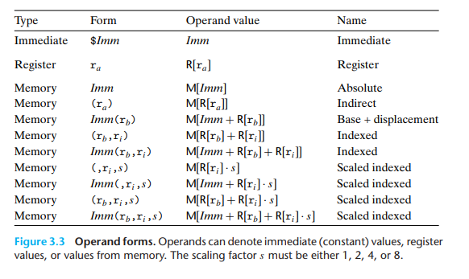
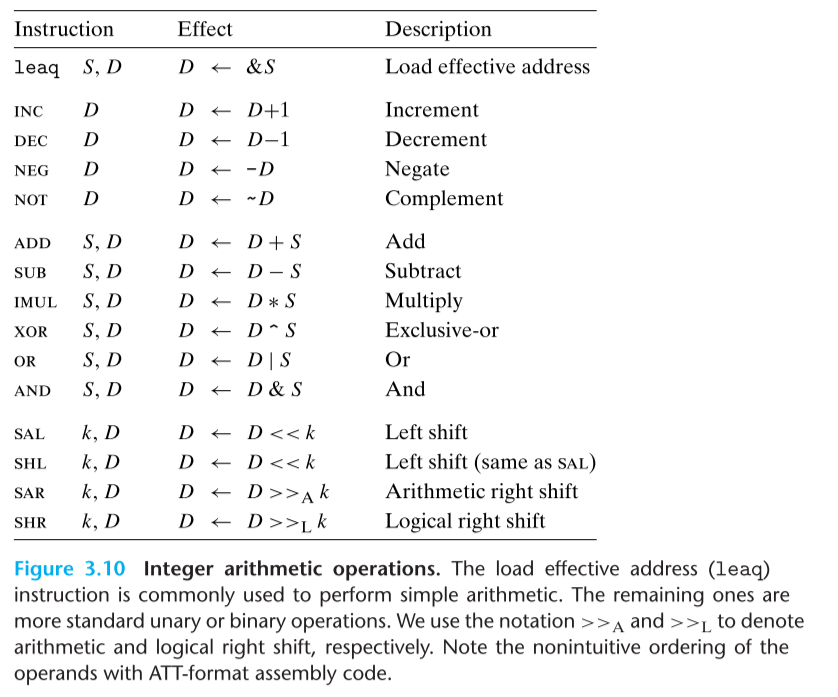

# Chapter 3 x86-64 Assembly

## 3.1 编译与反编译工具
> `gcc`编译文件
```bash
# 将C源文件编译至汇编级别
$ gcc -Og -S test.c
# -Og -O2 -O1 代表优化级别

# 编译至目标代码级别
$ gcc -c test.c
```
> 反汇编器
```bash
$ objdump -d bin
```

## 3.2 x86-64 汇编语言(AT&T格式)

### 3.2.1 数据访问与信息格式

1. 三类访问对象：立即数、寄存器、储存器
2. 数据格式：  

3. 整数寄存器：

4. 指令格式：


### 3.2.2 指令

#### **数据传送指令**
> 大写代表一类运算，根据格式自动加上指令后缀  
> 小写代表特定运算

1. 等长数据传送：


> x86-64特点：
> 1. 传送指令的两个操作数不能都指向内存位置 
> 2. 任何为寄存器生成32位值的行为都会将寄存器高位置为0

2. 数据扩充传送：  

零扩充：


符号扩充：


3. 栈操作：


4. 算术运算：



特别的算术运算：


#### **跳转指令**

1. 条件码设置与使用指令

> 符号寄存器`flag`：  
> `ZF`: zero flag 零标志位  
> `SF`: sign flag 符号标志位  
> `CF`: carry flag 进位标志位, 用于无符号数运算  
> `OF`: overflow flag 溢出标志位，用于有符号数运算

*设置条件码*：

> `leap`不改变标志位  
> 逻辑操作不改变`CF`, `OF`  
> `dec, inc`不改变进位标志位


*条件码的使用：set指令*
> `set`指令根据`flag`的状态设定单位字节`D`为1或0
> 练习题参看3-13,3-14


2. 跳转指令：

> 间接跳转：  
> `jmp *%rax`：以%rax中地址为目标跳转  
> `jmp *(%rax)`：以内存`(%rax)`中地址为目标跳转

> 相对寻址：  
> 计算相对地址时，基址为`jmp`指令下一条指令的地址

