# Chapter 4 处理器体系结构

> ISA(Instruction-Set Architecture): 处理器支持的指令以及指令字节编码

## 4.1 Y86-64指令集体系结构

> 一个指令集体系结构包括：
> 1. 状态单元
> 2. 指令集及其编码
> 3. 编程规范
> 4. 异常处理

### 4.1.1 状态单元


1. `RF`: 程序寄存器。各个寄存器的使用与x86基本一样，为了简化省略了`%r15`
2. `CC`: 条件码。Y86仅有3位：`ZF, SF, OF`
3. `PC`: 程序计数器。存放当前正在执行指令的地址。
4. `stat`: 状态码。指示程序运行是否出现异常。
5. `DMEM`: 内存。

### 4.1.2 指令集及其编码

1. 指令集编码  

    
    Y86指令集基本是x86指令集的子集，仅支持:
    - 8字节整数的操作
    - 基址-偏移寻址
    - 运算指令仅能对寄存器进行操作
    - `halt`指令使处理器停止运行，并设置`stat`为`HLT`

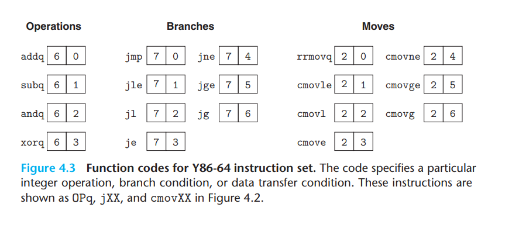


> 程序寄存器存在于CPU中的一个寄存器文件中，寄存器文件是一个RAM

2. Y86-64中指令的约定

对于`pushq, popq`指令来说，分别有一个指令行为是不确定的：
```x86asm
pushq   %rsp
popq    %rsp
```
通过小实验[`pushtest`](./../../csapplab/archlab/sim/misc/pushtest.ys)
[`poptest`](./../../csapplab/archlab/sim/misc/poptest.ys)确定：
- `pushq %rsp`将`%rsp`压入堆栈而不是`%rsp-8`
- `popq %rsp`将`(%rsp)`的值赋给`%rsp`而不是`%rsp+8`


### 4.1.3 异常


> 在更完整的设计中，CPU会中断调用异常处理程序(exception handler)

## 4.2 逻辑设计与硬件控制语言HCL

### 4.2.1 逻辑门

基本逻辑门：与或非门


HCL语言表达:
```C
bool out1= a && b;
bool out2= a || b;
bool out= !a;
```

### 4.2.2 bit级组合电路

组合电路的限制：
- 每个逻辑门的输入必须是以下之一：
    - 系统输入
    - 储存器单元的输出
    - 逻辑门的输出
- 逻辑门的输出不能连接在一起
- 组合电路无环

1. 同或组合电路


```C
bool eq = (a && b) || (!a && !b)
```
与之对应的异或
```C
bool xor = (a && !b) || (!a && b)
```

2. 多路复用器(multiplexor)


```C
out = (s && a) || (!s && b)
```

### 4.2.3 word级组合电路

1. 同或组合电路

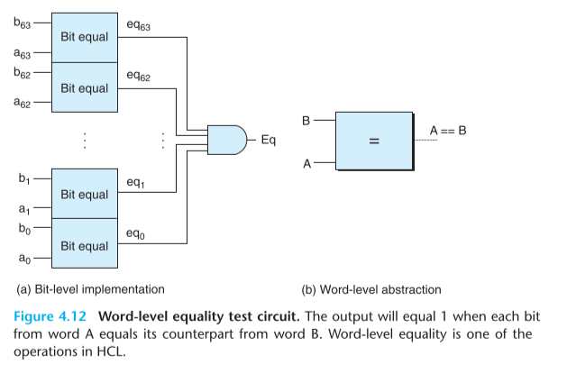

```C
bool eq = A==B
```

2. 多路复用器(multiplexor)

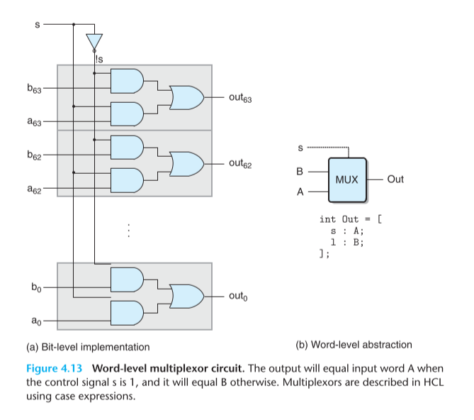

与位级组合电路不同，字级组合电路根据输入控制位s产生字级的数据，其HCL语言如下表达：
```C
word out = [
    s : A;
    1 : B;
];
```

3. 其他组合电路

- 无控制信号的组合电路

    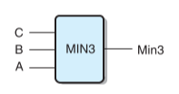
    
    ```C
    word Min3 = [
        A <= B && A<= C : A;
        B <= C          : B;
        1               : C;
    ]
    ```

- 多控制信号的组合电路

    
    计算单元内部有一个四路复用器, 根据两个控制信号`s1, s0`来选择输出：  

    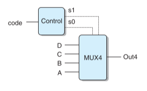

    控制信号的生成和四路复用器HCL表述如下:
    ```C
    bool s1 = code in {2, 3}
    bool s0 = code in {1, 3}
    /*等价于
    bool s1 = code == 2 || code ==3
    bool s0 = code ==1 || code ==3
     */
    Out4 = {
       !s1 && !s0   : A; // 00
       !s1          : B; // 01
       !s0          : C; // 10 
       1            : D; // 11 
    }
    ```

### 4.2.4 时钟和储存器

> - 时钟寄存器（简称寄存器)存储单个位或字。时钟信号控制寄存器加载输入值。时钟周期信号上升沿改变寄存器输入。Y86处理器中PC, CC, Stat由一个时钟寄存器保存。而寄存器文件的写也是由时钟信号控制。
>  
> - 随机访问存储器（简称内存）存储多个字，用地址来选择该读或该写哪个字。包括：
>   - 虚拟内存系统
>   - 寄存器文件

1. **硬件寄存器与程序寄存器**

当说到寄存器: 
    - 硬件寄存器指的是一个将输入输出接入电路的记忆单元，它的输入由时钟信号控制。我们应该从硬件的角度来理解它，它是程序层面不可见的，如PC，CC，Stat的值可能存在一个寄存器里但我们无法访问它。
    - 程序寄存器指的是寄存器文件里可寻址的单元，它是我们写程序时可见的。例如`%rax, %rbx, ...`

2. 时钟信号控制输入

向寄存器文件写入字是由时钟信号控制的，类似于将值加载到时钟寄存器，即时钟上升沿改变输入。

Y86-64中储存器结构如下:
- RF  

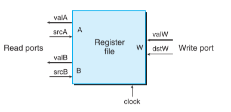

- DMEM  

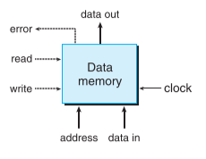


## 4.3 Y86-64的顺序实现

### 4.3.1 指令分段


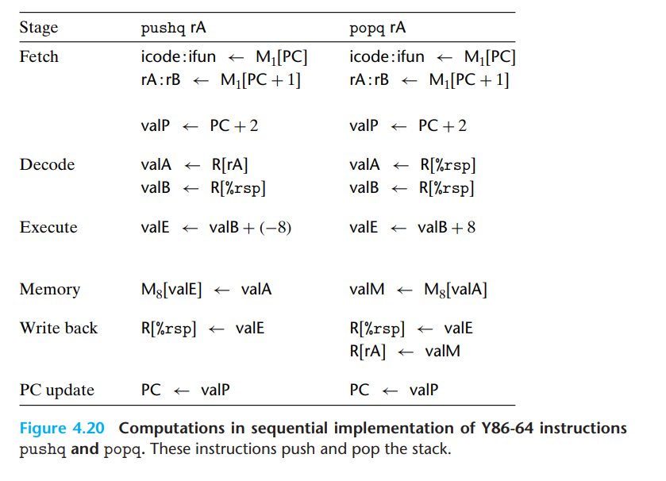
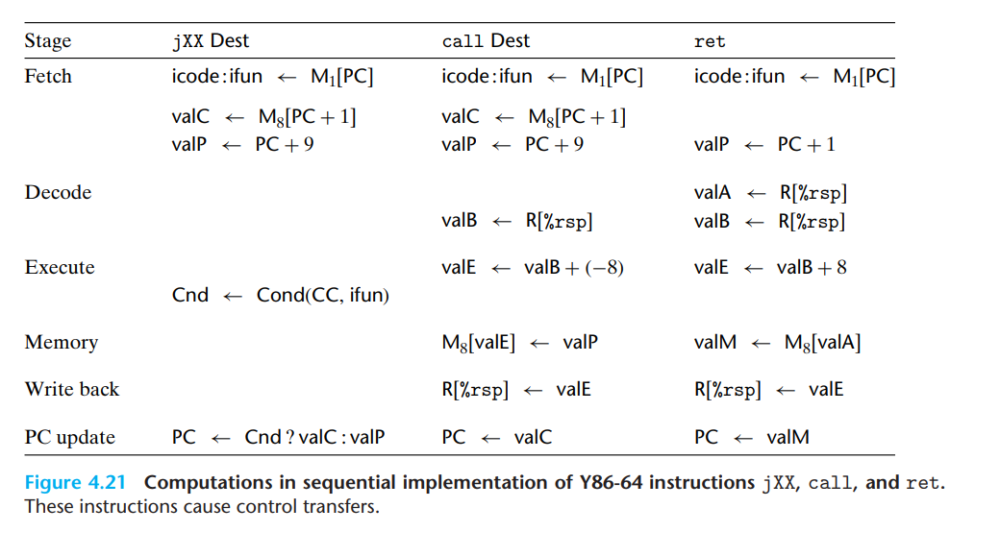


### 4.3.2 各阶段的逻辑实现

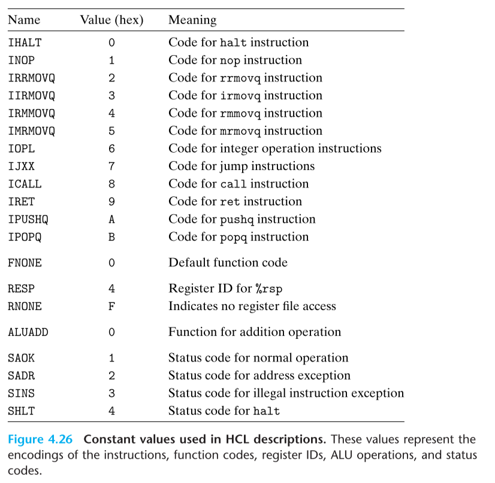

1. 取指  
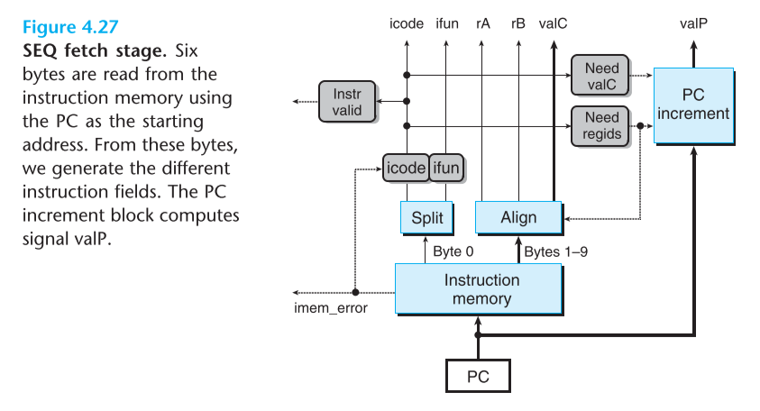
```HCL
word icode = [
    imem_error : INOP;
    1 : imem_icode;
];
word ifun = [
    imem_error : FNONE;
    1 : imem_ifun;
];

bool instr_valid = icode in { 
    IIRMOVQ, IRRMOVQ, IMRMOVQ, IRMMOVQ, IPUSHQ, 
    IPOPQ, IOPQ, IJXX, ICALL, IRET, IHALT, INOP
};
bool need_valC = icode in {
    IIRMOVQ, IMRMOVQ, IRMMOVQ, IJXX, ICALL
};
bool need_regids = icode in {
    IIRMOVQ, IRRMOVQ, IMRMOVQ, IRMMOVQ, IOPQ, IPUSHQ, IPOPQ
};
```
此阶段，instruction memory中有：`imem_icode, imem_ifun, rA, rB, valC`  
根据指令得到`icode, ifun`，根据信号计算得到`valP`。

2. 译码和写回  

```HCL
word srcA = [
    icode in { IRRMOVQ, IRMMOVQ, IOPQ, IPUSHQ } : rA;
    icode in { IPOPQ, IRET } : RRSP;
    1 : RNONE;
];
word srcB = [
    icode in { IRMMOVQ, IMRMOVQ, IOPQ } : rB; 
    icode in { IPUSHQ, IPOPQ, ICALL, IRET} : RRSP;
    1 : RNONE;
];
word dstE = [
    icode in { IRRMOVQ } && Cnd : rB;
    icode in { IIRMOVQ, IOPQ} : rB;
    icode in { IPUSHQ, IPOPQ, ICALL, IRET } : RRSP;
    1 : INONE;
];
word dstM = [
    icode in { IMRMOVQ, IPOPQ } : rA
    1 : INONE;
];
```

3. 执行  
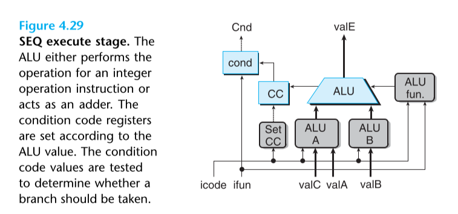
```HCL
word aluA = [
    icode in { IOPQ, IRRMOVQ } : valA;
    icode in { IIRMOVQ, IMRMOVQ, IRMMOVQ } : valC;
    icode in { IPUSHQ, ICALL } : -8;
    icode in { IPOPQ, IRET } : +8;
];
word aluB = [
    icode in { IOPQ, IRMMOVQ, IMRMOVQ, IPUSHQ, IPOPQ, ICALL, IRET } : valB;
    icode in { IRRMOVQ, IIRMOVQ } : 0
];
word alu_fun = [
    icode in { IOPQ } : ifun;
    1 : ALUADD;
];
word set_cc = icode in { IOPQ };
```

4. 访存  

```HCL
bool mem_read = icode in { IMRMOVQ, IPOPQ, IRET };
bool mem_write = icode in { IRMMOVQ, IPUSHQ, ICALL };
word mem_data = [
    icode in { ICALL } : valP;
    icode in { IRMMVOQ, IPUSHQ } : valA;
];
word mem_addr = [
    icode in { IRMMOVQ, IMRMOVQ, IPUSHQ, ICALL} : valE;
    icode in { IPOPQ, IRET } : valA;
];
word Stat = [
    imem_error || dmem_error : SADR;
    !instr_valid : SINS;
    icode == IHALT : SHLT;
    1 : SAOK;     
];
```

5. 更新PC  

```HCL
new_pc = [
    icode == IJXX && Cnd : valC
    icode == ICALL : valC;
    icode == IRET : valM;
    1 : valP;
];
```

## 4.4 流水线的通用原理

> 吞吐量(throughout): 单位时间内处理指令的数量  
> 延迟(latency): 一条指令执行所需时间

### 4.4.1 分阶段流水线

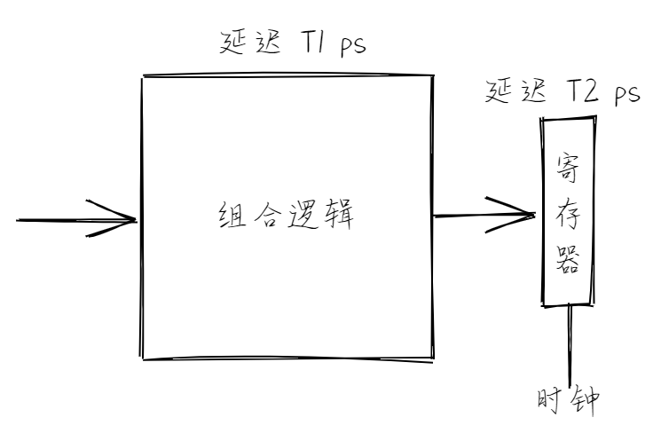

若组合逻辑被分为$k$个阶段，则吞吐量和延迟分别为
$$
L(k)=T_1/k+T2 \\
T(k)=k/L(k)
$$

### 4.4.2 带反馈的流水线

相邻指令之间可能：
- 数据相关
- 控制流顺序相关

## 4.5 流水线的实现

seq+:  


pipe-:  
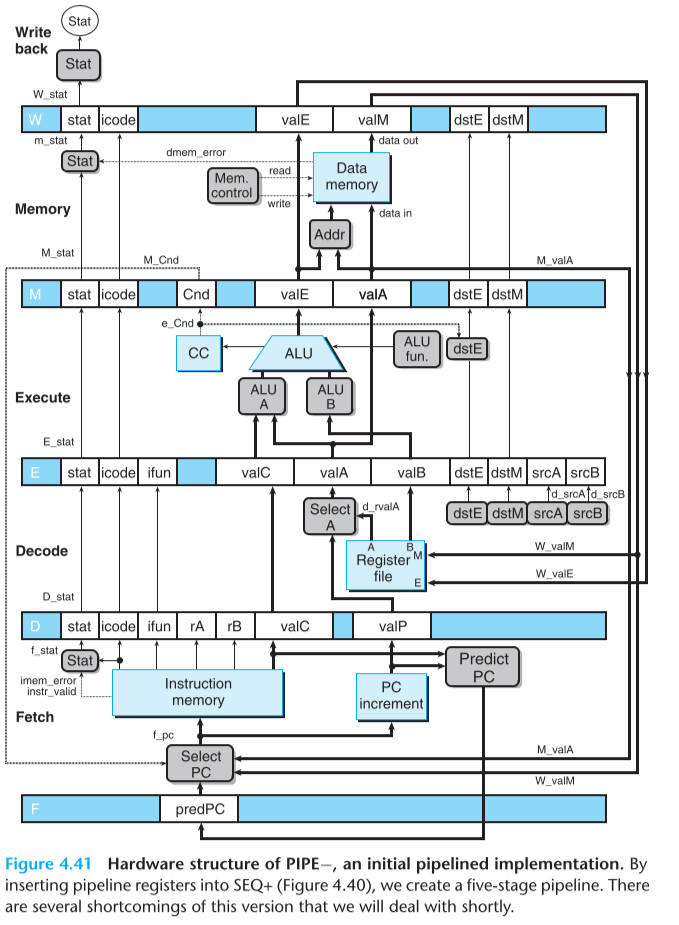

pipe:  
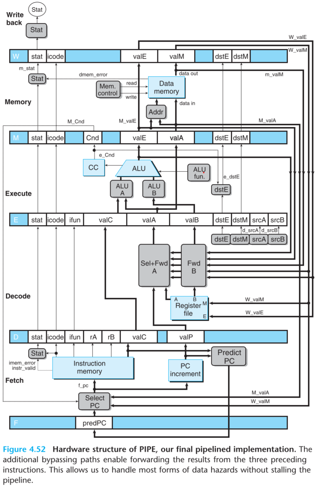