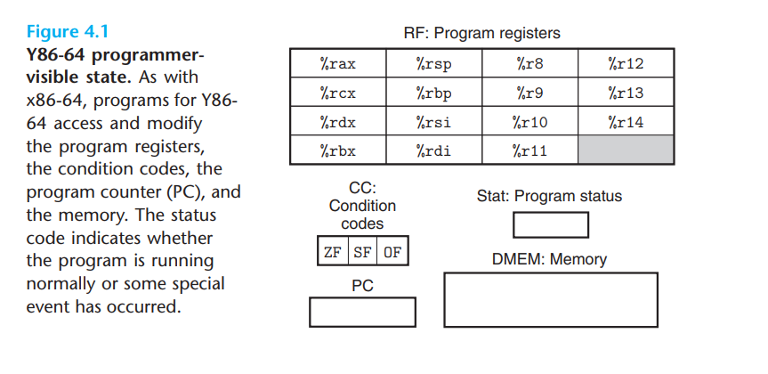
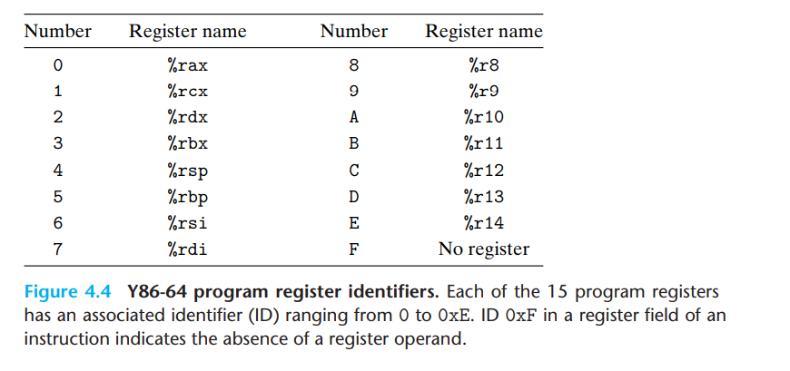
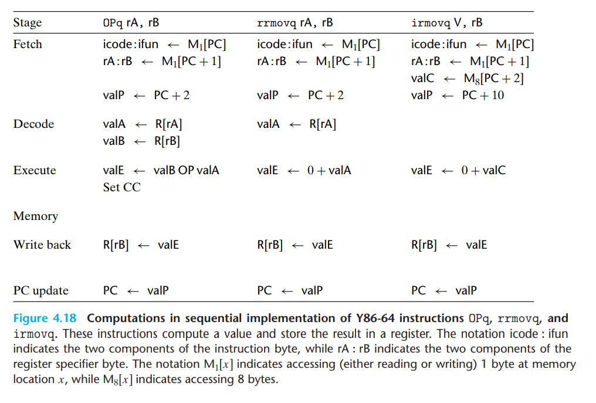
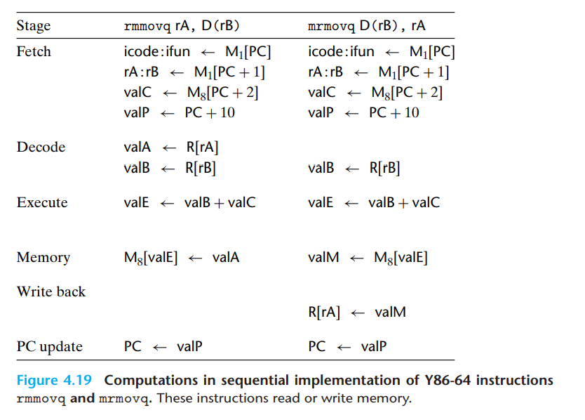
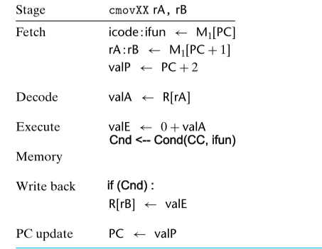
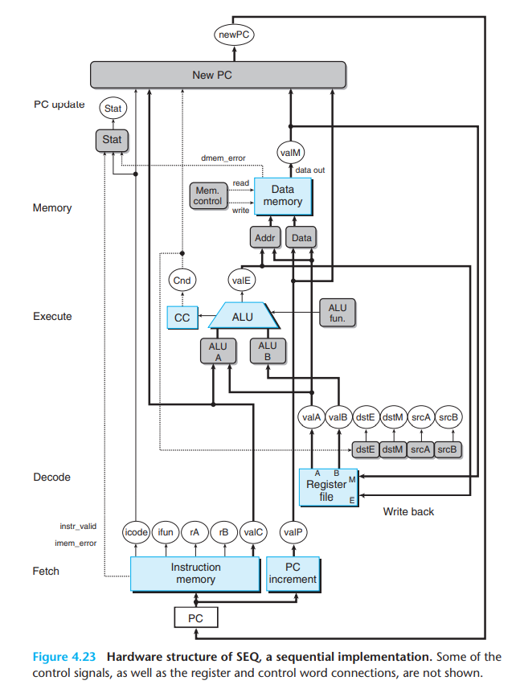

# Chapter 4 处理器体系结构

> ISA(Instruction-Set Architecture): 处理器支持的指令以及指令字节编码

## 4.1 Y86-64指令集体系结构

> 一个指令集体系结构包括：
> 1. 状态单元
> 2. 指令集及其编码
> 3. 编程规范
> 4. 异常处理

### 4.1.1 状态单元


1. `RF`: 程序寄存器。各个寄存器的使用与x86基本一样，为了简化省略了`%r15`
2. `CC`: 条件码。Y86仅有3位：`ZF, SF, OF`
3. `PC`: 程序计数器。存放当前正在执行指令的地址。
4. `stat`: 状态码。指示程序运行是否出现异常。
5. `DMEM`: 主存。

### 4.1.2 指令集及其编码


Y86指令集基本是x86指令集的子集，仅支持:
- 8字节整数的操作
- 基址-偏移寻址
- 运算指令仅能对寄存器进行操作



> 程序寄存器存在于CPU中的一个寄存器文件中，寄存器文件是一个RAM

### 4.1.3 异常


> 在更完整的设计中，CPU会中断调用异常处理程序(exception handler)

## 4.3 Y86-64的顺序实现








```

```